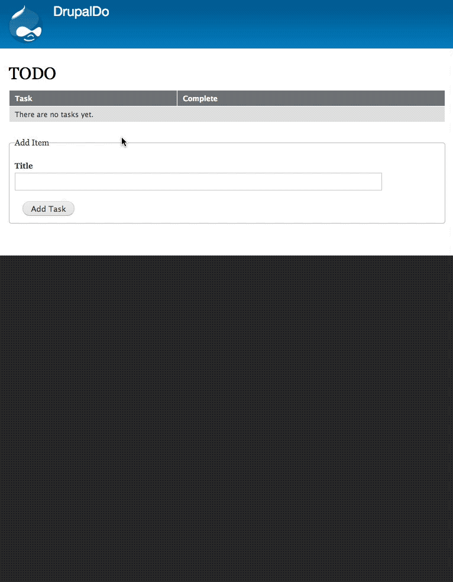

# drupaldo

1. Install dependencies with composer:
    ```
    $ composer install
    ```
2. Create `/web/sites/default/settings.local.php`, and add database settings.... Or skip to 3a

3. Install the site from config with:

    ```
    $ drush site:install --existing-config
    ```

3a. Install the site from config with a sqlite database.

    ```
    $ drush site:install--db-url=sqlite://web/sites/default/files/.ht.sqlite --existing-config
    ```

4. Create a test user, and login:

    ```
    $ drush user:create test
    $ drush user:login --name=test
    ```

## Demo


## Scenario

Tragedy strikes! The client made last minute revisions to the UI of the todo list and the project owner went to Paris (Ontario) on vacation. It's your job to take his work and make it as close to the new mockup as possible.

Your primary objective is to adapt the current functionality to appear as close to the new mockup as possible. The client knows that they are adding functionality with the mockup, and that everything might not be possible under such a short deadline. I know it's 3pm on a Friday and you have a hockey game to watch at 5pm, but please do your best in the time given; we're counting on you!

## Objective


Try to make the current todo list look as close to this mockup as possible. Currently the functionality of "mark as complete" works a little how I'd imagine the delete icon currently works. This is primarily a front end task, testing a developer's ability to manipulate a Drupal backend task to look different from how a backend developer left it. Adapting the backend code to allow the crossed-out functionality would be a bonus feature that I'm sure the "client" would be impressed by, but should not be the main focus.
